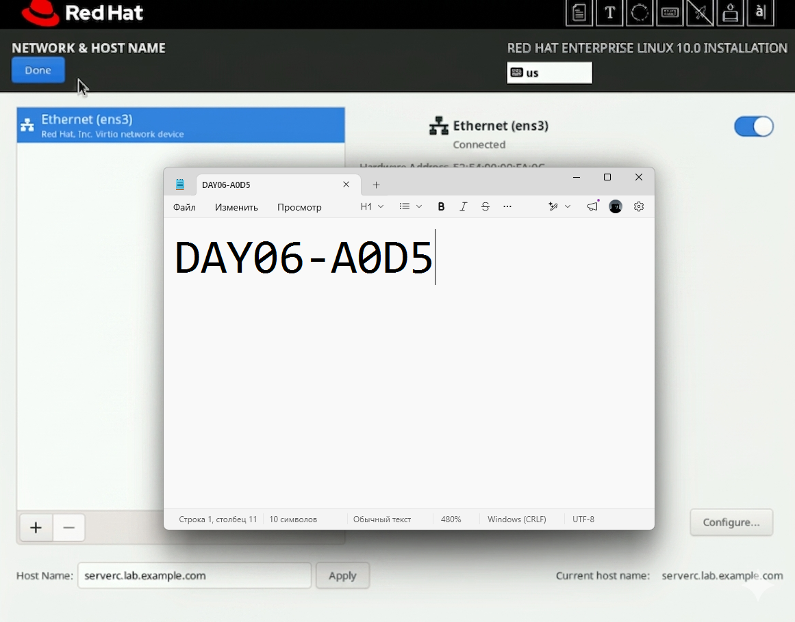
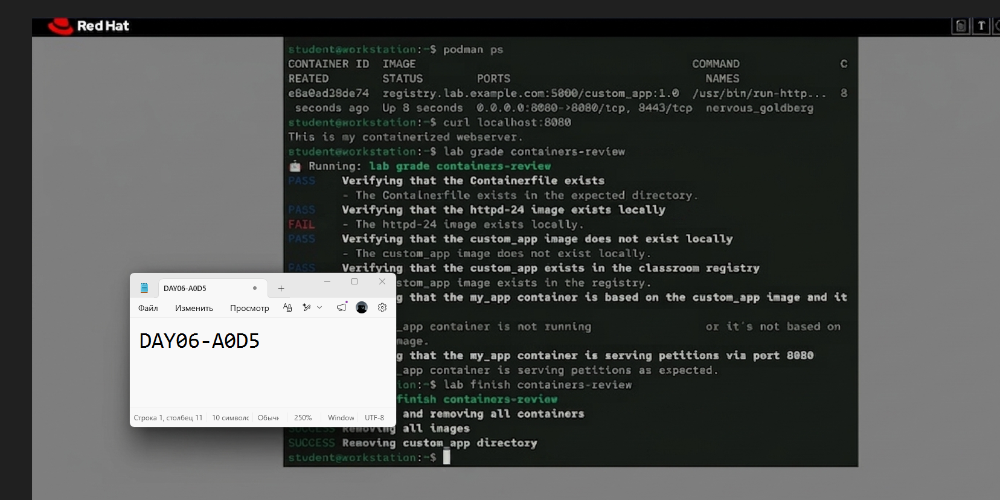
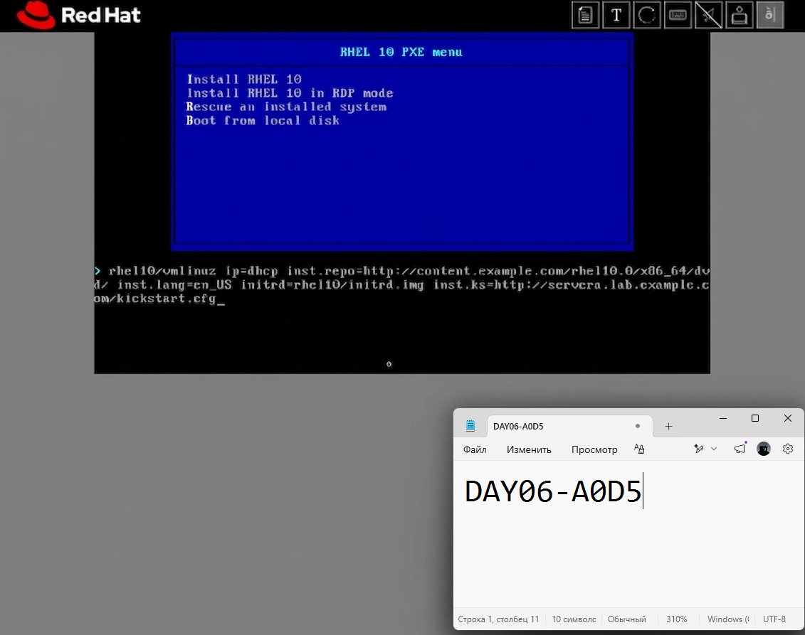
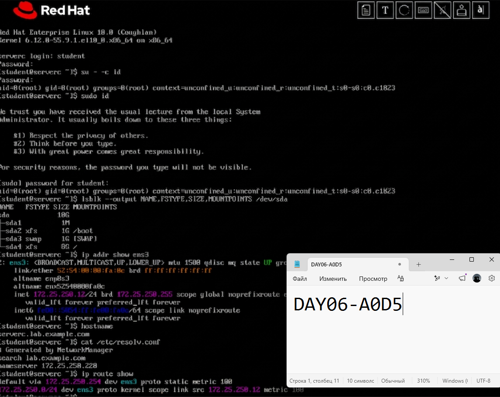
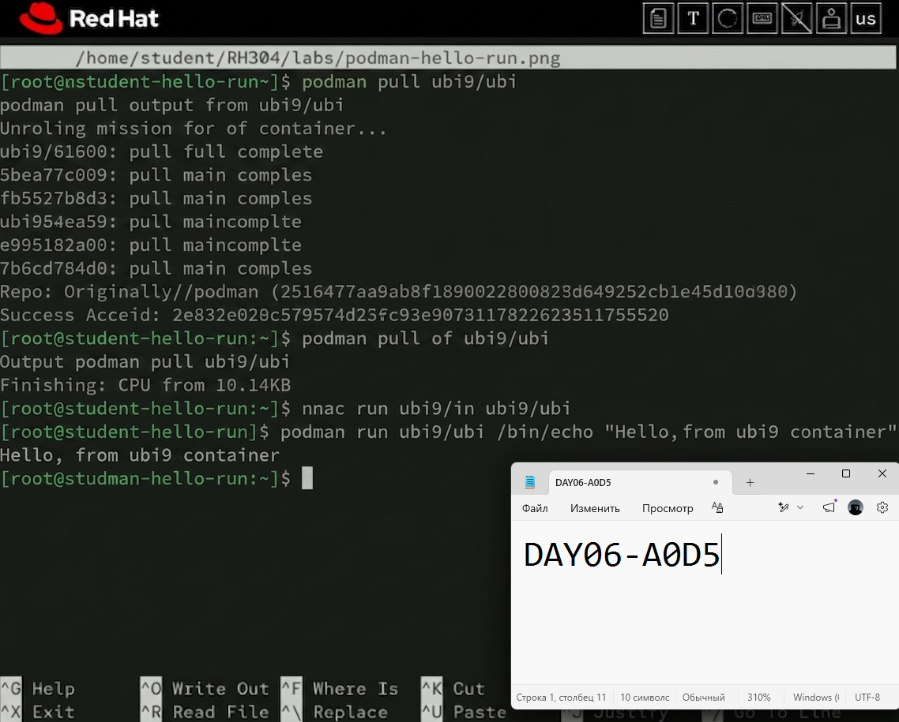
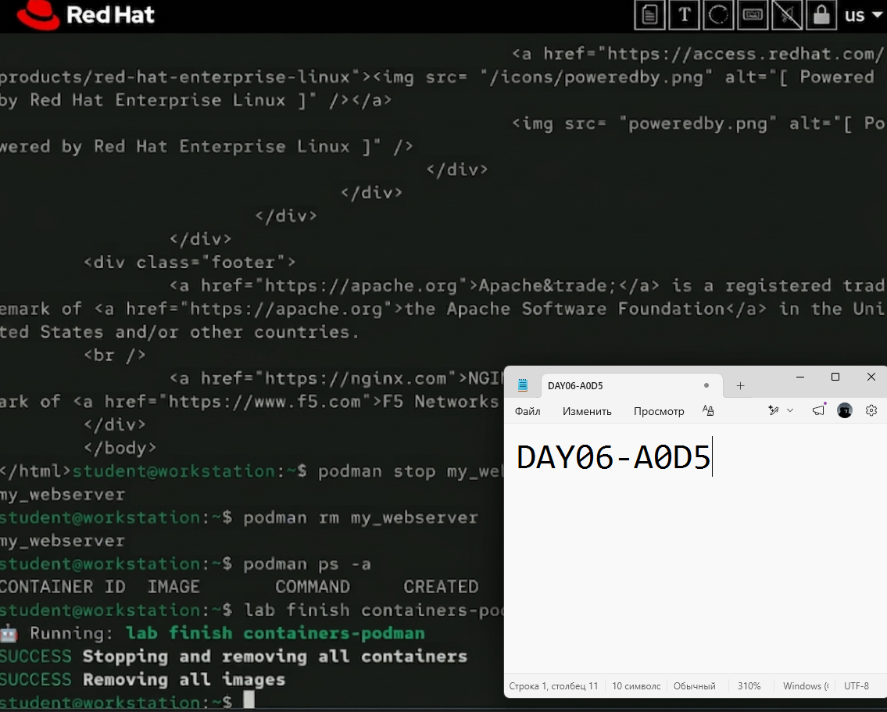
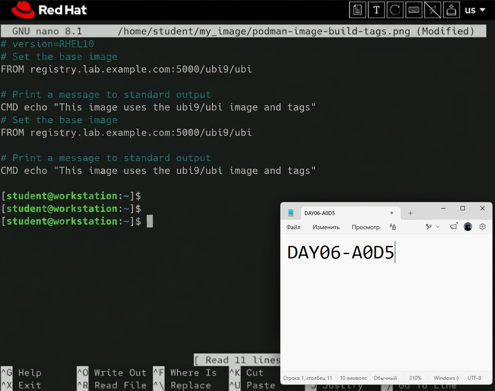
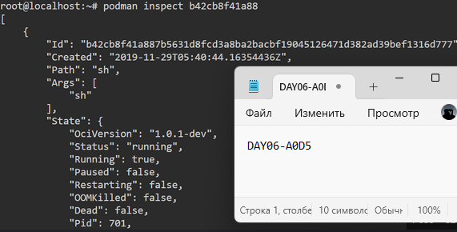
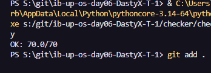

# Скриншоты и подписи Day06

## Индекс доказательств

| Файл | Что видно на скриншоте | Есть token | Связанный этап |
| --- | --- | --- | --- |
| `interactive-install-summary-or-console.png` | Экран `Anaconda` или просмотр install/tmux logs во время ручной установки | да | Guided Exercise: Install Red Hat Enterprise Linux Interactively |
| `interactive-install-verification.png` | Проверки `id`, `sudo id`, `lsblk`, сеть и hostname после ручной установки | да | Проверка интерактивной установки |
| `kickstart-ksvalidator.png` | Успешный `ksvalidator` или ключевые фрагменты Kickstart-файла | да | Guided Exercise: Automate Red Hat Enterprise Linux Installation with Kickstart |
| `kickstart-install-verification.png` | Проверки `nmcli`, `hostnamectl`, `lsblk`, `apropos fstab` после Kickstart | да | Проверка установки через Kickstart |
| `podman-hello-run.png` | Запуск контейнера `Hello Red Hat!` и/или удаление завершившегося контейнера | да | Guided Exercise: Run Containers with Podman |
| `podman-webserver-detached.png` | `my_webserver`, `podman ps` и `curl 127.0.0.1:8080` | да | Guided Exercise: Run Containers with Podman |
| `podman-image-build-tags.png` | Сборка `my_image:1.0` и `my_image:1.1`, список локальных образов | да | Guided Exercise: Create and Manage Container Images |
| `podman-inspect-or-push.png` | `podman image inspect`, `podman image push` или `podman search --list-tags` | да | Guided Exercise: Create and Manage Container Images |
| `containers-review-grade.png` | Результат `lab grade containers-review` | да | Lab: Manage Containers with Podman |
| `local-checker-and-report.png` | Локальный checker и итоговый отчёт | нет | Финальная сдача |

## Вставленные скриншоты

## Вставленные скриншоты

Подпись: На скриншоте показаны результаты проверки после ручной установки и учебный token DAY06-A0D5

Подпись: На скриншоте показан итог встроенной проверки контейнерной Lab и token DAY06-A0D5

Подпись: На скриншоте показан итог interactive-install-verification и token DAY06-A0D5

Подпись: На скриншоте показан итог kickstart-ksvalidator и token DAY06-A0D5

Подпись: На скриншоте показан итог kickstart-install-verification и token DAY06-A0D5

Подпись: На скриншоте показан итог podman-hello-run и token DAY06-A0D5

Подпись: На скриншоте показан итог podman-webserver-detached и token DAY06-A0D5

Подпись: На скриншоте показан итог podman-image-build-tags и token DAY06-A0D5

Подпись: На скриншоте показан итог podman-inspect-or-push и token DAY06-A0D5

Подпись: На скриншоте показан итог local-checker-and-report и token DAY06-A0D5

Вставьте реальные скриншоты ниже. Минимум должно быть 10 отдельных изображений с подписями:

1. `interactive-install-summary-or-console.png`
2. `interactive-install-verification.png`
3. `kickstart-ksvalidator.png`
4. `kickstart-install-verification.png`
5. `podman-hello-run.png`
6. `podman-webserver-detached.png`
7. `podman-image-build-tags.png`
8. `podman-inspect-or-push.png`
9. `containers-review-grade.png`
10. `local-checker-and-report.png`
